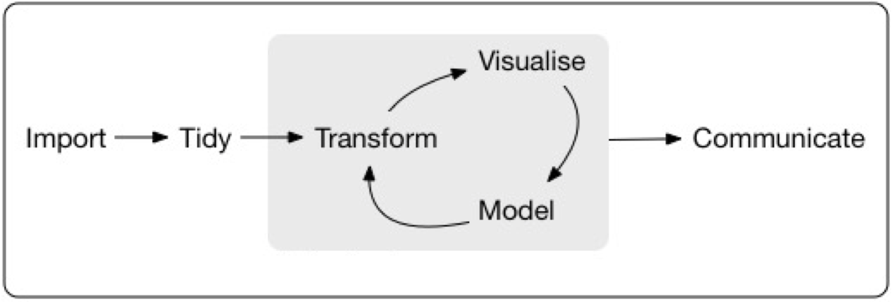
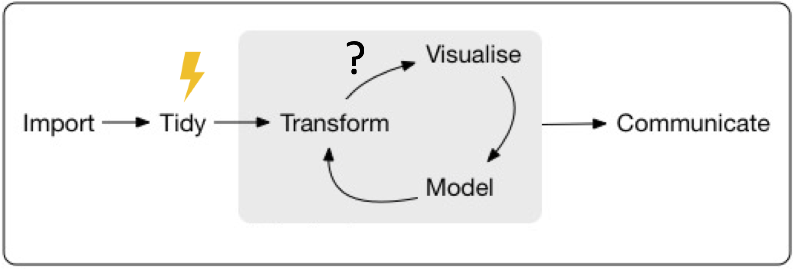

```{r setup, include=FALSE}
knitr::opts_chunk$set(echo = FALSE)
library(targets)
library(tarchetypes)
library(xaringanthemer)
```

## データ解析ワークフローを無駄<br>なく、再現可能にするRパッケージ「targets」の紹介

**ニッタ ジョエル**

BioPackathon <span style = 'font-size: 120%;'>2022/01/12</span>

<br><br>

<br><br>https://joelnitta.com

---

## 自己紹介

.pull-left[
**ニッタ （新田）ジョエル**

@joel_nitta

https://joelnitta.com

- [東京大学岩崎研究室](http://iwasakilab.k.u-tokyo.ac.jp/)

- 特任助教

- 研究テーマ：シダ植物の<br>進化、生態学

- 趣味：マラソン
]

.pull-right[

]

---
## 発表のアウトライン

- {targets}の紹介

- ライブコーディング

---
## ワークフローについて話しましょう



.footnote[R for Data Science https://r4ds.had.co.nz/]

---
## ワークフローについて話しましょう



ワークフローの**一部が変わってしまったら**、他のところが<br>**どう影響されるのか**？

**どこまでやり直す必要があるのか？**

---
## 再現性について話しましょう

### あなとのワークフローを再現できますか？

- 今すぐに？

- 数ヶ月（あるいは数年）後に？

- 他の誰かが？


---
## ワークフロー管理ツールに<br>任せましょう！

たくさんあります：

- `make`（bash）
- `snakemake`（python）
- `nextflow`（バイオインフォ系）
- `cwl`

などなど


---

## {targets}とは？

.pull-left[
- Rの**ワークフロー管理パケージ**

- ワークフローの**必要なところだけを走らせる**

- ワークフローを書く段階で<br>**パラレル化する**

- 計算結果がコードとデータと一致していることを証明する
]


---
## Resources 資料

- Github https://github.com/ropensci/targets

- Package website https://docs.ropensci.org/targets/

- User manual https://books.ropensci.org/targets/

- Targetopia https://wlandau.github.io/targetopia/

- {tarchetypes} website https://docs.ropensci.org/tarchetypes/

- [@u_ribo](https://twitter.com/u_ribo)さんの[発表](https://speakerdeck.com/s_uryu/workflow-management-with-targets)

---
## Live Coding

- `tar_script()`: ワークフロープランを書く

- `tar_visnetwork()`: ワークフローロを確認する

- `tar_make()`: ワークフローを実行する

- `tar_load()`: ターゲットを読み込む

- `tar_outdated()`：次回走らせるところを予測する

---
class: inverse, center, middle

# Live Coding

---
## gapminderの例

https://github.com/joelnitta/targets_gapminder_example

---
## まとめ

- `_targets.R`にワークフロープランを書く

- `tar_run()`でワークフローを走らせる

- `tar_visnetwork()`でワークフローの状況を可視化する

---
## 「もっと知りたい」と思ったら...

User manual https://books.ropensci.org/targets/


---
class: inverse, center, middle

# ご清聴ありがとう<br>ございました

